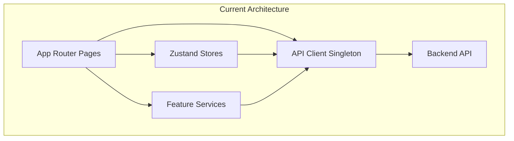

# Academix 2.0 — Frontend Engineering Improvement Plan

> **Scope**: `d:\Programing\Academix 2.0\client\src\`
> **Goal**: Transform this codebase into a production-grade SaaS frontend while consciously applying CS & SE principles at every step.

---

## Architecture Overview (Current State)



**Key Strengths Already Present:**
- Singleton pattern on `ApiClient` ✅
- Zod schema validation for forms ✅
- Feature-scoped `_components`, `_hooks`, `_services` co-location ✅
- Reducer pattern in Chat/Email apps ✅
- Clean provider composition tree ✅

---

## Phase 1 — API Layer & Repository Pattern

> **Concepts**: Repository Pattern, Dependency Inversion (SOLID-D), Adapter Pattern, Single Responsibility

### 1.1 Extract a Generic Repository Interface

| Item | Detail |
|------|--------|
| **File** | [api-client.ts](file:///d:/Programing/Academix%202.0/client/src/lib/api-client.ts) |
| **Problem** | Every service file (e.g., `organization.service.ts`, `payment-service.ts`) calls `apiClient.get/post` directly, coupling them to the HTTP transport. |
| **Concept** | **Repository Pattern** + **Dependency Inversion Principle** |
| **Action** | Create `src/lib/repository.ts` — a generic typed repository. |

```typescript
// src/lib/repository.ts
interface Repository<T, CreateDTO = Partial<T>> {
  getAll(params?: Record<string, unknown>): Promise<T[]>
  getById(id: string): Promise<T>
  create(data: CreateDTO): Promise<T>
  update(id: string, data: Partial<T>): Promise<T>
  delete(id: string): Promise<void>
}

// Concrete implementation backed by ApiClient
class ApiRepository<T, CreateDTO = Partial<T>> implements Repository<T, CreateDTO> {
  constructor(private basePath: string, private client: ApiClient) {}

  async getAll(params?: Record<string, unknown>) {
    return this.client.get<T[]>(this.basePath, { params })
  }
  async getById(id: string) {
    return this.client.get<T>(`${this.basePath}/${id}`)
  }
  // ... create, update, delete
}
```

**Benefit**: Services depend on the `Repository` interface, not on `apiClient`. You can swap the implementation for testing (mock repository) or migrate transports without touching business logic.

### 1.2 Refactor Feature Services to Use Repository

| Item | Detail |
|------|--------|
| **Files** | [organization.service.ts](file:///d:/Programing/Academix%202.0/client/src/app/%5Blang%5D/%28dashboard-layout%29/organizations/_services/organization.service.ts), `checkout/_services/payment-service.ts` |
| **Problem** | Plain object literals with methods that directly import `apiClient`. No interface, no abstraction. |
| **Concept** | **Facade Pattern**, **Interface Segregation (SOLID-I)** |

```diff
- import { apiClient } from "@/lib/api-client"
-
- export const organizationService = {
-   getUserOrganizations: async () => {
-     return apiClient.get<OrganizationMembership[]>("/users/organizations")
-   },
- }

+ import { ApiRepository } from "@/lib/repository"
+
+ // Typed repository for organizations
+ const orgRepo = new ApiRepository<Organization>("/organizations", apiClient)
+
+ export class OrganizationService {
+   async getUserOrganizations() {
+     return orgRepo.getAll()
+   }
+   async getById(id: string) {
+     return orgRepo.getById(id)
+   }
+ }
+ export const organizationService = new OrganizationService()
```

### 1.3 Unify Error Handling via Result Type

| Item | Detail |
|------|--------|
| **File** | [api-client.ts](file:///d:/Programing/Academix%202.0/client/src/lib/api-client.ts) L37–83 |
| **Problem** | Error handling is scattered — `ApiClientError` thrown from client, caught differently in each component (compare `sign-in-form.tsx` vs `register-form.tsx` vs `checkout-client.tsx`). |
| **Concept** | **Result/Either Monad** (functional error handling), **DRY** |

```typescript
// src/lib/result.ts
type Result<T, E = ApiClientError> =
  | { ok: true; data: T }
  | { ok: false; error: E }

// Usage in services — no try/catch at call sites
const result = await organizationService.create(data)
if (!result.ok) {
  handleError(result.error) // centralized
  return
}
// result.data is typed
```

---

## Phase 2 — State Management Architecture

> **Concepts**: Command Pattern, Observer Pattern, Separation of Concerns, Single Responsibility

### 2.1 Decouple Business Logic from Cart Store

| Item | Detail |
|------|--------|
| **File** | [cart-store.ts](file:///d:/Programing/Academix%202.0/client/src/stores/cart-store.ts) |
| **Problem** | The store mixes **API calls**, **toast notifications**, **price calculations**, and **state mutations** in a single 267-line file. The `addToCart` action alone does: API call → state update → toast → error toast. This violates SRP. |
| **Concept** | **Single Responsibility Principle**, **Command Pattern**, **Domain Service** |

**Refactoring Strategy:**

```
src/
├── stores/
│   └── cart-store.ts          # Pure state: cart data, selectors
├── services/
│   └── cart-service.ts        # API calls only
├── domain/
│   └── cart-calculator.ts     # Price/discount computation (pure functions)
└── commands/
    └── cart-commands.ts       # Orchestrates: service → store → toast
```

```typescript
// domain/cart-calculator.ts — Pure functions, easily testable
export function calculateItemTotal(price: number, discount: number): number {
  return price * (1 - discount / 100)
}

export function calculateCartTotal(items: CartItem[]): number {
  return items.reduce((sum, item) => {
    const course = typeof item.courseId !== "string" ? item.courseId : null
    if (!course) return sum
    return sum + calculateItemTotal(course.price, course.discount ?? 0)
  }, 0)
}
```

> [!IMPORTANT]
> The selectors `selectTotalPrice` and `selectItemCount` (L245–265) already show good instincts — they're derivations from state. Move them into `cart-calculator.ts` as pure functions and have the store call them.

### 2.2 Normalize Chat Reducer with Immutable Update Patterns

| Item | Detail |
|------|--------|
| **File** | [chat-reducer.ts](file:///d:/Programing/Academix%202.0/client/src/app/%5Blang%5D/%28dashboard-layout%29/apps/chat/_reducers/chat-reducer.ts) |
| **Problem** | Three nearly identical action handlers (`addTextMessage`, `addImagesMessage`, `addFilesMessage`) differ only in the message payload shape. Massive code duplication (~90 lines repeated 3 times). |
| **Concept** | **DRY**, **Discriminated Unions**, **Normalization** |

```typescript
// Unified message factory
function createMessage(payload: Partial<MessageType>): MessageType {
  return {
    id: crypto.randomUUID(),
    senderId: "1",
    status: "DELIVERED",
    createdAt: new Date(),
    ...payload,
  }
}

function getLastMessageContent(msg: MessageType): string {
  if (msg.text) return msg.text
  if (msg.images) return msg.images.length > 1 ? "Images" : "Image"
  if (msg.files) return msg.files.length > 1 ? "Files" : "File"
  return ""
}

// Unified handler — replaces 3 separate cases
case "addMessage": {
  if (!state.selectedChat) return state
  const newMessage = createMessage(action.payload)
  const updatedChat = {
    ...state.selectedChat,
    lastMessage: { content: getLastMessageContent(newMessage), createdAt: newMessage.createdAt },
    messages: [newMessage, ...state.selectedChat.messages],
  }
  return {
    ...state,
    chats: state.chats.map(c => c.id === updatedChat.id ? updatedChat : c),
  }
}
```

### 2.3 Add Optimistic Updates to Purchased Courses Store

| Item | Detail |
|------|--------|
| **File** | [purchased-courses-store.ts](file:///d:/Programing/Academix%202.0/client/src/stores/purchased-courses-store.ts) |
| **Problem** | `fetchPurchasedCourses` fetches every time it's called. No caching, no staleness check, no optimistic state. |
| **Concept** | **Cache-Aside Pattern**, **Stale-While-Revalidate** |

```typescript
interface PurchasedCoursesState {
  courses: string[]
  lastFetchedAt: number | null  // timestamp
  isLoading: boolean
  
  fetchIfStale: (maxAge?: number) => Promise<void>
  hasPurchased: (courseId: string) => boolean  // O(1) via Set
}

// Use a Set internally for O(1) lookups instead of array.includes() → O(n)
```

---

## Phase 3 — Component Architecture & Design Patterns

> **Concepts**: Compound Component Pattern, Render Props, Composition over Inheritance, Open/Closed Principle

### 3.1 Decompose RegisterForm (475 lines → Compound Components)

| Item | Detail |
|------|--------|
| **File** | [register-form.tsx](file:///d:/Programing/Academix%202.0/client/src/components/auth/register-form.tsx) |
| **Problem** | 475-line monolith containing: step validation logic, form state, image upload handling, API submission, error routing to steps, and 5 step UIs. Violates SRP and OCP. |
| **Concept** | **Compound Component Pattern**, **State Machine**, **Open/Closed Principle** |

**Target Architecture:**

```
components/auth/register/
├── register-form.tsx              # Orchestrator only (~50 lines)
├── register-form-context.tsx      # Shared form state via context
├── steps/
│   ├── basic-info-step.tsx
│   ├── role-selection-step.tsx
│   ├── password-step.tsx
│   ├── profile-image-step.tsx
│   └── verification-step.tsx
└── use-register-wizard.ts         # Step navigation + validation state machine
```

```typescript
// use-register-wizard.ts — Finite State Machine for step flow
type WizardState = "basicInfo" | "role" | "password" | "image" | "verify"

const TRANSITIONS: Record<WizardState, { next?: WizardState; validate: string[] }> = {
  basicInfo: { next: "role", validate: ["name", "email"] },
  role:      { next: "password", validate: ["role"] },
  password:  { next: "image", validate: ["password", "confirmPassword"] },
  image:     { next: "verify", validate: [] },
  verify:    { validate: [] },
}
```

> [!TIP]
> This is a textbook **State Pattern** application. Each step is a discrete state with its own validation rules and transitions. The current `switch(step)` in `validateStep` is the procedural equivalent.

### 3.2 Extract Auth Error Handling Strategy

| Item | Detail |
|------|--------|
| **File** | [sign-in-form.tsx](file:///d:/Programing/Academix%202.0/client/src/components/auth/sign-in-form.tsx) L56–134 |
| **Problem** | The `onSubmit` handler parses error strings with `.startsWith("EMAIL_VERIFICATION_REQUIRED:")` and `.split(":")` — fragile string-based error routing across 4 different error types. |
| **Concept** | **Strategy Pattern**, **Error Classification**, **Chain of Responsibility** |

```typescript
// src/lib/auth-error-handler.ts
interface AuthErrorStrategy {
  canHandle(error: string): boolean
  handle(error: string, context: AuthErrorContext): void
}

class EmailVerificationStrategy implements AuthErrorStrategy {
  canHandle(error: string) { return error.startsWith("EMAIL_VERIFICATION_REQUIRED:") }
  handle(error: string, ctx: AuthErrorContext) {
    const email = error.split(":")[1]
    ctx.toast({ title: ctx.dict.emailVerificationRequired })
    ctx.router.push(ensureLocalizedPathname(`/verify-email?email=${encodeURIComponent(email)}`, ctx.locale))
  }
}

// Chain of Responsibility
const strategies: AuthErrorStrategy[] = [
  new EmailVerificationStrategy(),
  new TwoFactorStrategy(),
  new AccountDisabledStrategy(),
]

export function handleAuthError(error: string, ctx: AuthErrorContext) {
  const strategy = strategies.find(s => s.canHandle(error))
  if (strategy) strategy.handle(error, ctx)
  else throw new Error(error)
}
```

### 3.3 Build a Dashboard Card Factory

| Item | Detail |
|------|--------|
| **File** | [dashboard-card.tsx](file:///d:/Programing/Academix%202.0/client/src/components/dashboards/dashboard-card.tsx) |
| **Problem** | 4 card variants (`DashboardCard`, `DashboardOverviewCard`, `V2`, `V3`) with heavy prop overlap. Adding a V4 requires copying ~50 lines. Violates OCP. |
| **Concept** | **Factory Pattern**, **Composition over Inheritance**, **Open/Closed Principle** |

```typescript
// Compose from primitives instead of creating new variants
<DashboardCard>
  <DashboardCard.Header title="Revenue" icon={DollarSign} />
  <DashboardCard.Metric value={45000} format="currency" />
  <DashboardCard.Change value={12.5} />
  <DashboardCard.Chart>{sparkline}</DashboardCard.Chart>
</DashboardCard>
```

---

## Phase 4 — Type System & Domain Modeling

> **Concepts**: Algebraic Data Types, Branded Types, Discriminated Unions, Domain-Driven Design

### 4.1 Apply Branded Types for IDs

| Item | Detail |
|------|--------|
| **File** | [api.ts](file:///d:/Programing/Academix%202.0/client/src/types/api.ts) |
| **Problem** | All IDs are `string`. You can accidentally pass a `courseId` where an `organizationId` is expected. The compiler won't catch it. |
| **Concept** | **Branded/Nominal Types**, **Type Safety** |

```typescript
// src/types/branded.ts
type Brand<T, B extends string> = T & { readonly __brand: B }

type CourseId = Brand<string, "CourseId">
type UserId = Brand<string, "UserId">
type OrganizationId = Brand<string, "OrganizationId">
type CartId = Brand<string, "CartId">

// Constructor functions
const CourseId = (id: string) => id as CourseId
const UserId = (id: string) => id as UserId

// Now the compiler catches misuse:
function getCourse(id: CourseId): Promise<Course> { ... }
getCourse(UserId("abc")) // ❌ Type error!
```

### 4.2 Discriminated Unions for API Responses

| Item | Detail |
|------|--------|
| **File** | [api.ts](file:///d:/Programing/Academix%202.0/client/src/types/api.ts) L21–30 |
| **Problem** | `ApiResponse<T>` uses `success: boolean` — consumers must check `success` then hope `data` exists. No compiler enforcement. |
| **Concept** | **Discriminated Union / Tagged Union (ADT)** |

```typescript
// Current — unsafe
interface ApiResponse<T> { success: boolean; message: string; data: T }

// Improved — compiler-enforced
type ApiResponse<T> =
  | { success: true; data: T; message: string }
  | { success: false; error: ApiError; message: string }

// Exhaustive checking:
function handle<T>(res: ApiResponse<T>) {
  if (res.success) {
    res.data   // ✅ TypeScript knows data exists
  } else {
    res.error  // ✅ TypeScript knows error exists
  }
}
```

### 4.3 Centralize & Partition the Type Barrel

| Item | Detail |
|------|--------|
| **Files** | [api.ts](file:///d:/Programing/Academix%202.0/client/src/types/api.ts) (649 lines), [types.ts](file:///d:/Programing/Academix%202.0/client/src/types.ts) (169 lines) |
| **Problem** | One 649-line file contains types for courses, users, organizations, payments, coupons, and more. Finding anything requires scrolling through unrelated domains. |
| **Concept** | **Bounded Contexts (DDD)**, **Module Cohesion** |

```
src/types/
├── index.ts          # Re-exports (barrel)
├── common.ts         # ApiResponse, PaginatedResponse, Brand utilities
├── auth.ts           # User, Session, Token types
├── course.ts         # Course, Lesson, Section, Category
├── commerce.ts       # Cart, Payment, Coupon, BillingData
├── organization.ts   # Organization, Membership, Invitation
└── ui.ts             # Navigation, Settings, Form types
```

---

## Phase 5 — Performance Optimization

> **Concepts**: Memoization, Structural Sharing, Lazy Loading, Debouncing

### 5.1 Memoize Expensive Selectors

| Item | Detail |
|------|--------|
| **File** | [cart-store.ts](file:///d:/Programing/Academix%202.0/client/src/stores/cart-store.ts) L245–265 |
| **Problem** | `selectTotalPrice` iterates all cart items and recalculates on every render, even when cart hasn't changed. |
| **Concept** | **Memoization**, **Derived State** |

```typescript
import { createSelector } from "reselect"

// Memoized — only recalculates when cart.items reference changes
export const selectTotalPrice = createSelector(
  (state: CartState) => state.cart?.items ?? [],
  (items) => items.reduce((total, item) => {
    const course = typeof item.courseId !== "string" ? item.courseId : null
    if (!course) return total
    const discount = course.discount ?? 0
    return total + course.price * (1 - discount / 100)
  }, 0)
)
```

### 5.2 Virtualize Long Lists

| Item | Detail |
|------|--------|
| **Files** | `store-list.tsx` (course grid), chat sidebar (chat list), sidebar navigation |
| **Problem** | All items rendered in DOM regardless of viewport visibility. |
| **Concept** | **Windowing / Virtual Scrolling** |
| **Tool** | `@tanstack/react-virtual` or `react-window` |

### 5.3 Debounce Store Filter URL Updates

| Item | Detail |
|------|--------|
| **File** | [store-view.tsx](file:///d:/Programing/Academix%202.0/client/src/app/%5Blang%5D/%28dashboard-layout%29/public/store/store-view.tsx) L50–66 |
| **Problem** | `updateURL` calls `router.push` on every filter change, triggering a full server-side re-render per keystroke in search. |
| **Concept** | **Debouncing**, **Throttling** |

```typescript
import { useDebouncedCallback } from "use-debounce"

const debouncedUpdateURL = useDebouncedCallback((filters: CourseFilterParams) => {
  const params = new URLSearchParams()
  // ... build params
  router.push(`${pathname}?${params.toString()}`)
}, 300)
```

### 5.4 Deduplicate Concurrent API Requests

| Item | Detail |
|------|--------|
| **File** | [api-client.ts](file:///d:/Programing/Academix%202.0/client/src/lib/api-client.ts) |
| **Problem** | Multiple components mounting simultaneously can trigger duplicate GET requests for the same resource. |
| **Concept** | **Request Deduplication**, **Promise Coalescing** |

```typescript
class ApiClient {
  private inflightRequests = new Map<string, Promise<unknown>>()

  async get<T>(url: string, options?: RequestOptions): Promise<T> {
    const key = `GET:${url}:${JSON.stringify(options?.params)}`
    if (this.inflightRequests.has(key)) {
      return this.inflightRequests.get(key) as Promise<T>
    }
    const promise = this._fetch<T>(url, options)
      .finally(() => this.inflightRequests.delete(key))
    this.inflightRequests.set(key, promise)
    return promise
  }
}
```

---

## Phase 6 — Cross-Cutting Concerns

### 6.1 Split the God Utility File

| Item | Detail |
|------|--------|
| **File** | [utils.ts](file:///d:/Programing/Academix%202.0/client/src/lib/utils.ts) (402 lines) |
| **Problem** | Contains date formatters, currency formatters, file utilities, color converters, path helpers, and dictionary accessors — all in one file. |
| **Concept** | **Cohesion**, **Module Decomposition** |

```
src/lib/
├── utils.ts              # Only cn() and truly generic helpers
├── formatters/
│   ├── date.ts           # formatDate, formatRelativeDate
│   ├── currency.ts       # formatCurrency, formatOverviewCardValue
│   └── file.ts           # formatFileSize, getFileExtension
├── color.ts              # hexToHSL, hslToHex
└── path.ts               # ensureRedirectPathname, isActivePathname
```

### 6.2 Centralize Route Protection Logic

| Item | Detail |
|------|--------|
| **File** | [middleware.ts](file:///d:/Programing/Academix%202.0/client/src/middleware.ts) |
| **Problem** | The middleware handles i18n detection, auth redirects, email verification checks, 2FA checks, and account status — all in one procedural flow (~172 lines). |
| **Concept** | **Chain of Responsibility**, **Middleware Pattern**, **Single Responsibility** |

```typescript
// src/middleware/chain.ts
type MiddlewareHandler = (
  req: NextRequest,
  ctx: MiddlewareContext
) => NextResponse | null  // null = pass to next handler

const middlewareChain: MiddlewareHandler[] = [
  localeDetectionMiddleware,
  authenticationMiddleware,
  emailVerificationMiddleware,
  twoFactorMiddleware,
  accountStatusMiddleware,
]

export function runMiddlewareChain(req: NextRequest): NextResponse {
  for (const handler of middlewareChain) {
    const response = handler(req, ctx)
    if (response) return response  // Short-circuit
  }
  return NextResponse.next()
}
```

### 6.3 Implement a Settings Migration System

| Item | Detail |
|------|--------|
| **File** | [settings-context.tsx](file:///d:/Programing/Academix%202.0/client/src/contexts/settings-context.tsx) L38–51 |
| **Problem** | Cookie migration is hardcoded: `const { theme: _t, lightness: _l, ...rest } = parsed`. Every future settings change requires editing this destructure. |
| **Concept** | **Migration Pattern**, **Version Control for Data** |

```typescript
// src/lib/settings-migrations.ts
interface SettingsMigration {
  version: number
  migrate: (settings: Record<string, unknown>) => Record<string, unknown>
}

const migrations: SettingsMigration[] = [
  { version: 1, migrate: (s) => { delete s.theme; delete s.lightness; return s } },
  { version: 2, migrate: (s) => { s.sidebarMode ??= "open"; return s } },
]

export function migrateSettings(raw: Record<string, unknown>): SettingsType {
  let current = raw
  const version = (raw._version as number) ?? 0
  for (const m of migrations) {
    if (m.version > version) current = m.migrate(current)
  }
  return { ...defaultSettings, ...current, _version: migrations.length }
}
```

---

## Implementation Priority Matrix

| Phase | Effort | Impact | Risk | Priority |
|-------|--------|--------|------|----------|
| **4.2** Discriminated Unions | 🟢 Low | 🔴 High | 🟢 Low | **P0** |
| **2.1** Cart Store SRP | 🟡 Med | 🔴 High | 🟡 Med | **P0** |
| **6.1** Split utils.ts | 🟢 Low | 🟡 Med | 🟢 Low | **P1** |
| **1.1** Repository Pattern | 🟡 Med | 🔴 High | 🟡 Med | **P1** |
| **3.1** RegisterForm decomposition | 🟡 Med | 🟡 Med | 🟢 Low | **P1** |
| **5.3** Debounce store filters | 🟢 Low | 🟡 Med | 🟢 Low | **P1** |
| **3.2** Auth Error Strategy | 🟢 Low | 🟡 Med | 🟢 Low | **P2** |
| **2.2** Chat Reducer DRY | 🟢 Low | 🟡 Med | 🟢 Low | **P2** |
| **5.1** Memoized selectors | 🟢 Low | 🟡 Med | 🟢 Low | **P2** |
| **4.1** Branded Types | 🟡 Med | 🟡 Med | 🟡 Med | **P2** |
| **5.4** Request dedup | 🟡 Med | 🟡 Med | 🟡 Med | **P2** |
| **4.3** Type file partition | 🟡 Med | 🟡 Med | 🟡 Med | **P3** |
| **6.2** Middleware chain | 🔴 High | 🟡 Med | 🔴 High | **P3** |
| **6.3** Settings migration | 🟢 Low | 🟢 Low | 🟢 Low | **P3** |
| **2.3** Cache-aside store | 🟡 Med | 🟡 Med | 🟡 Med | **P3** |
| **3.3** Dashboard Card factory | 🟡 Med | 🟢 Low | 🟢 Low | **P3** |
| **5.2** Virtual scrolling | 🟡 Med | 🟡 Med | 🟡 Med | **P3** |
| **1.3** Result type | 🟡 Med | 🟡 Med | 🟡 Med | **P3** |

---

## CS Concepts Quick Reference

| Concept | Where Applied | Section |
|---------|--------------|---------|
| **Singleton Pattern** | Already in `ApiClient` | — |
| **Repository Pattern** | API service layer | 1.1, 1.2 |
| **Strategy Pattern** | Auth error handling | 3.2 |
| **State Machine** | Register wizard | 3.1 |
| **Factory Pattern** | Dashboard cards | 3.3 |
| **Command Pattern** | Cart orchestration | 2.1 |
| **Observer Pattern** | Toast system (already) | — |
| **Chain of Responsibility** | Middleware refactor | 6.2 |
| **Compound Components** | Register form | 3.1 |
| **Discriminated Unions (ADT)** | API responses | 4.2 |
| **Branded/Nominal Types** | Entity IDs | 4.1 |
| **Memoization** | Store selectors | 5.1 |
| **Debouncing** | Search/filter updates | 5.3 |
| **DRY** | Chat reducer | 2.2 |
| **SRP (SOLID-S)** | Cart store, utils | 2.1, 6.1 |
| **OCP (SOLID-O)** | Dashboard cards | 3.3 |
| **DIP (SOLID-D)** | Repository interface | 1.1 |
| **ISP (SOLID-I)** | Service interfaces | 1.2 |
| **Cache-Aside** | Purchased courses | 2.3 |
| **Migration Pattern** | Settings versioning | 6.3 |
| **Bounded Contexts (DDD)** | Type file partition | 4.3 |
| **Request Deduplication** | API client | 5.4 |
